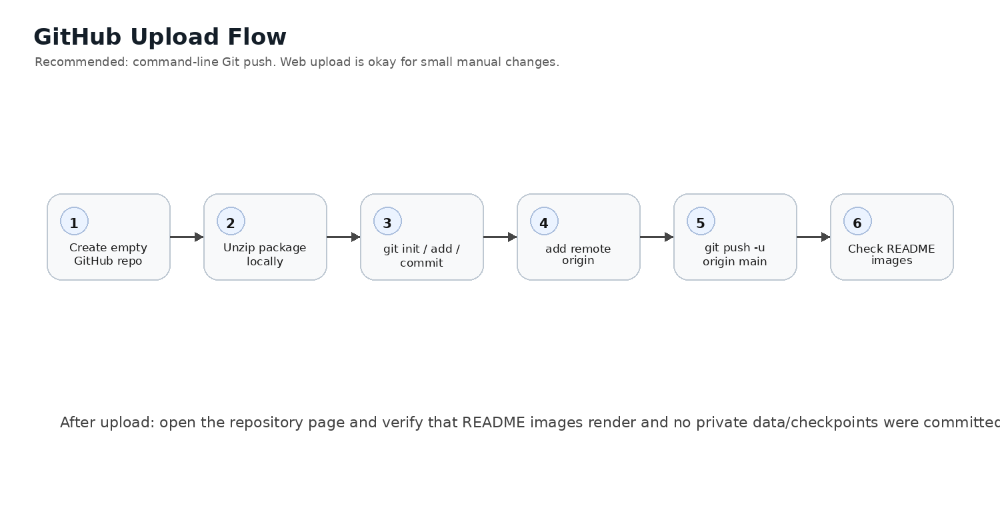

# GitHub Upload Notes — LiteRaceSegNet v9 + HoshiLM Project QA

이 패키지는 GitHub 업로드를 고려해 정리한 버전입니다. 핵심 모델은 LiteRaceSegNet 도로 손상 세그멘테이션이며, HoshiLM Project QA는 실험 결과와 설정 파일을 설명하기 위한 보조 인터페이스입니다.

## 공개용 설명 원칙

- LiteRaceSegNet은 segmentation prediction model입니다.
- HoshiLM Project QA는 reporting/support interface입니다.
- HoshiLM이 segmentation mask 성능을 개선한다고 주장하지 않습니다.
- 웹 UI는 HTML에 답변을 직접 고정하는 방식이 아니라, `/api/chat` 요청을 통해 Python QA 엔진에서 답변을 받는 구조입니다.
- 답변 근거는 `project_facts.json`, `project_qa_corpus.txt`, train log, dataset verification, config YAML입니다.

## 권장 GitHub 저장소 설명

> Lightweight road-damage segmentation project with a custom CNN model, SegFormer baseline comparison, and an optional HoshiLM Project QA interface for explaining experiment evidence.

## GitHub 업로드 전 확인

```bash
find . -maxdepth 3 -type f | sort
find . -type d -name runs
```

새로 학습해서 생긴 `runs/` 폴더나 대형 체크포인트는 기본적으로 GitHub에 올리지 않는 것을 권장합니다.

## AWS 실행

```bash
cd v8_hoshilm_submission/hoshilm_kr
bash run_project_qa_build.sh
bash run_project_qa_train.sh
bash run_project_qa_web.sh
```

웹 확인:

```text
http://AWS_PUBLIC_IP:8000
```


## 추가 문서

- `docs/GITHUB_UPLOAD_RUNBOOK_KO.md`: 실제 GitHub 업로드 명령어
- `docs/PROJECT_STRUCTURE_KO.md`: 공개 저장소 구조 설명
- `docs/github_assets/`: README에 표시되는 구조 이미지


