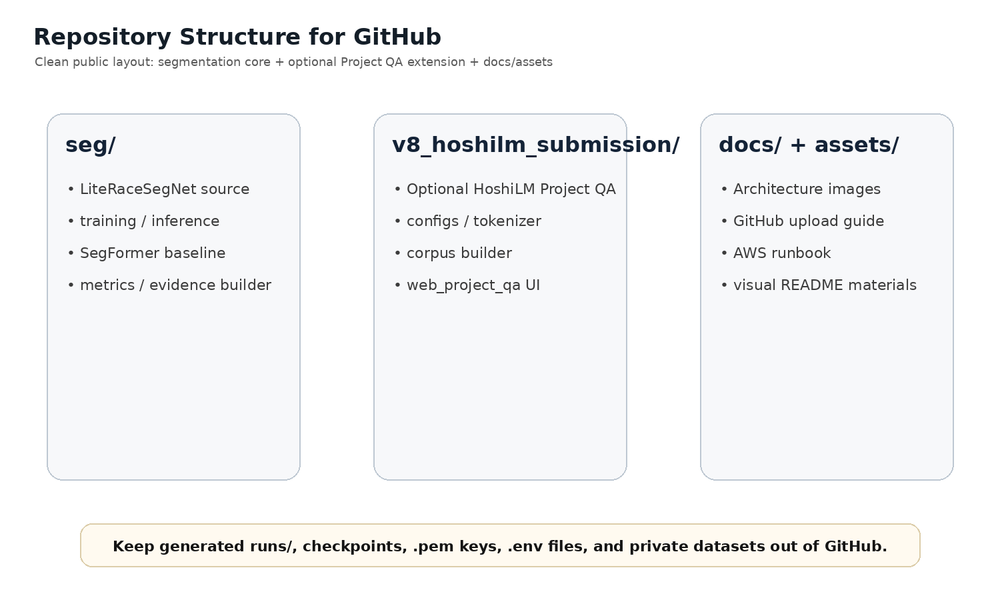

# Project Structure

## Root

- `README.md`: GitHub 첫 화면용 설명
- `.gitignore`: 대형 결과물, 개인키, 환경 파일 제외
- `README_GITHUB_UPLOAD_KO.md`: 공개 업로드 전 체크용 메모

## LiteRaceSegNet

- `seg/core/`: 경량 CNN 모델, 데이터셋, 학습 유틸리티
- `seg/train_literace.py`: LiteRaceSegNet 학습 진입점
- `seg/compare/`: baseline 비교 및 latency/metric export
- `seg/config/`: 실험 config YAML

## HoshiLM Project QA

- `v8_hoshilm_submission/hoshilm_kr/`: 소형 decoder-only Transformer 및 Project QA 코드
- `web_project_qa/index.html`: 로컬 Python API와 연결되는 QA 웹 UI
- `project_qa_api.py`: `/api/chat` 서버
- `build_project_qa_corpus.py`: 실험 결과 파일 기반 QA corpus 생성

## Docs / Assets

- `docs/assets/`: README에서 바로 보이는 구조 이미지
- `docs/github_assets/`: GitHub 업로드/구조/QA 흐름 이미지
